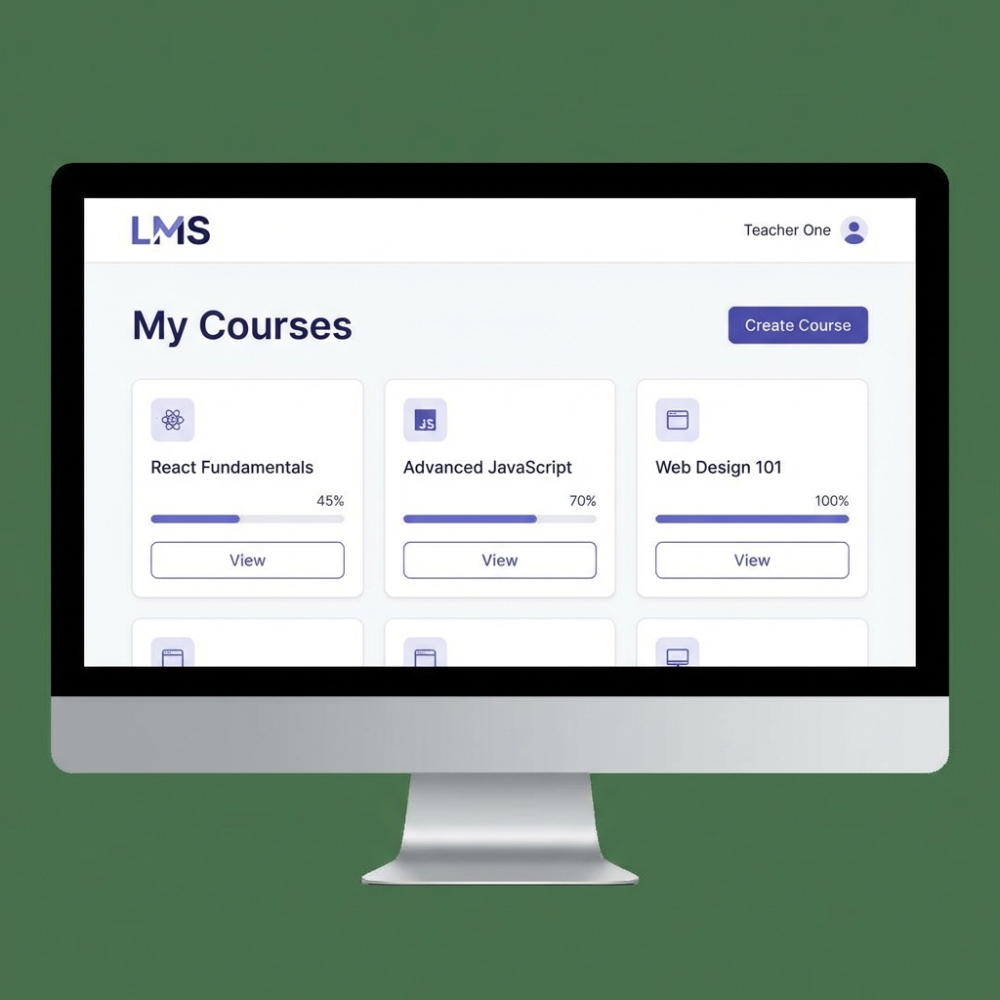
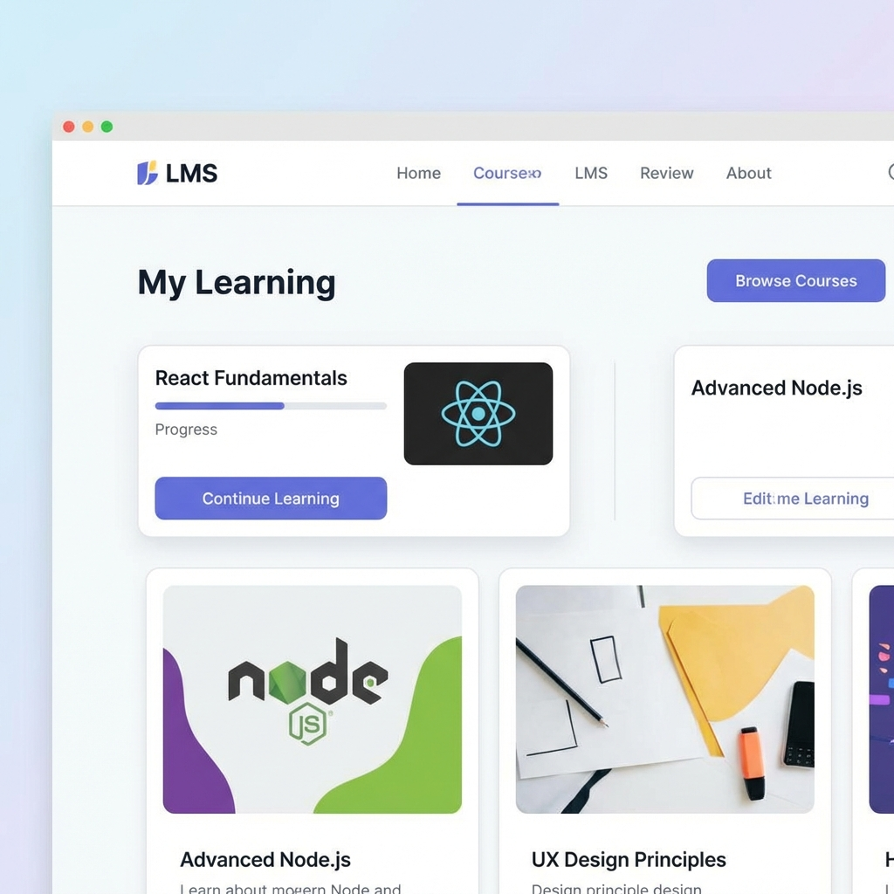

# LMS Frontend

A modern, responsive frontend for the Learning Management System, built with **React**, **Redux Toolkit**, and **CSS Modules**.

## ✨ Features

### 👩‍🏫 Teacher Portal
- **Dashboard**: View all created courses.
- **Course Management**: Create new courses with details.
- **Assignments**: Create assignments and view student submissions.
- **Secure Access**: Protected routes for teachers only.



### 👨‍🎓 Student Portal
- **Dashboard**: View enrolled courses.
- **Browse Courses**: Discover and enroll in new courses.
- **Assignment Submission**: Submit work for assignments.
- **Learning Tracking**: clear overview of active courses.



## 🛠 Tech Stack
- **Framework**: React (Vite)
- **State Management**: Redux Toolkit (includes async thunks)
- **Routing**: React Router v6
- **Styling**: CSS Modules (scoped styles) + Global CSS variables
- **HTTP Client**: Axios (with interceptors)
- **Icons**: Lucide React

## 🚀 Getting Started

1. **Install Dependencies**
   ```bash
   cd frontend
   npm install
   ```

2. **Start Development Server**
   ```bash
   npm run dev
   ```
   Access the app at `http://localhost:5173`.

3. **Backend Requirement**
   Ensure the backend API is running on `http://localhost:3000`.

## 📂 Project Structure
```
src/
 ├── components/       # Reusable UI components (Button, Input, Layout)
 ├── pages/            # Page components (Dashboard, Login, CourseDetail)
 ├── store/            # Redux slices (auth, course, assignment)
 ├── services/         # API service definitions
 └── utils/            # Helper functions
```

## 🧪 Verification
To verify the application:
1. Register as a **Teacher** to create courses.
2. Register as a **Student** to browse and enroll.
3. Use the **Course Detail** page to manage assignments.
